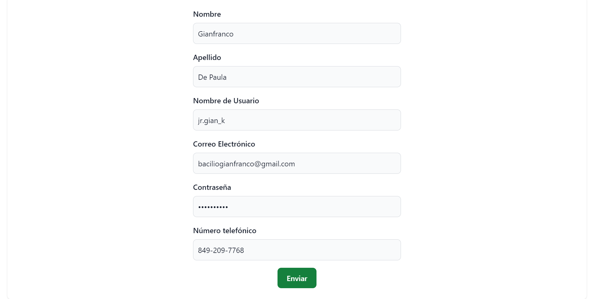
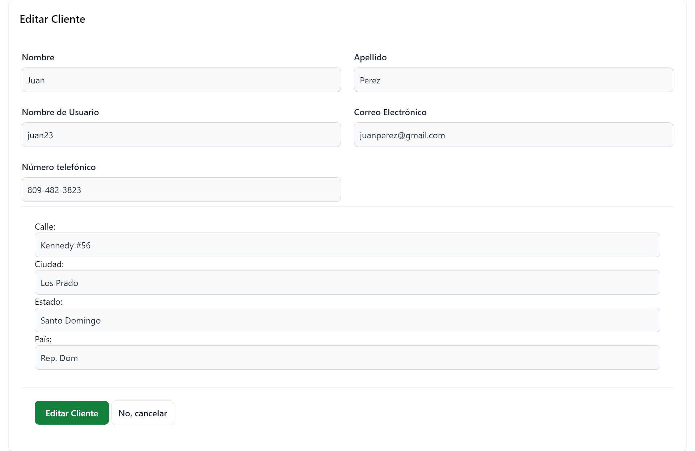
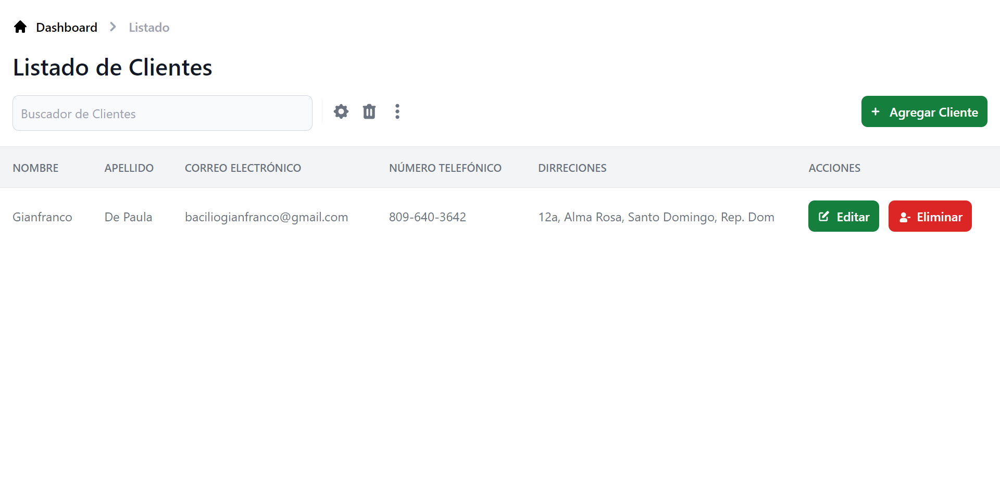

# Client Management

Esta es una aplicación que permite el manejo de varios clientes mediante un pequeño panel de administración. Mediante la misma se es capaz de asignar varias direcciones a un mismo cliente, así como también editar o eliminar la información del mismo.

Stack Utilizado:

- Django
- PosgreSQL
- HTML
- Tailwind CSS
- Git y Github

### 1. Login

En esta pagina es donde los usuarios pueden iniciar sesión. Sino tiene una cuenta puede presional el
boton para crear cuenta

### 2. Register

Aquí es donde los usuarios pueden crearse una cuenta de usuario para tener acceso al panel principal
que manaje los clientes.

### 3. Login

Accedemos al sitio con la cuenta que acabamos de crear.

### 4. Principal

Este es el panel principal donde podemos ver los clientes que se han creado hasta el momento y también podemos editarlos o eliminarlos.

### 5. Dirección

Cuando hacemos clic en editar la información de un cliente es que podemos agregar otra dirección
del mismo.

### 6. Agregar Cliente

Este es el apartado donde podemos agregar a un nuevo cliente y ahí mismo introducirle su primera
dirección.

### 7. Principal

Aquí podemos ver al nuevo cliente ya creado con todos sus datos.

### 8. Dirección

En este ejemplo podemos ver como le agregamos otra dirección a un mismo cliente.

### 9. Eliminar

A esta pantalla es donde venimos cuando se le da clic a eliminar un cliente. Aquí se nos
pregunta si estamos seguros de eliminar a dicho cliente.

### 10. Principal

Al eliminar al cliente podemos volver a la pantalla principal y vemos que el cliente a sido eliminado.

